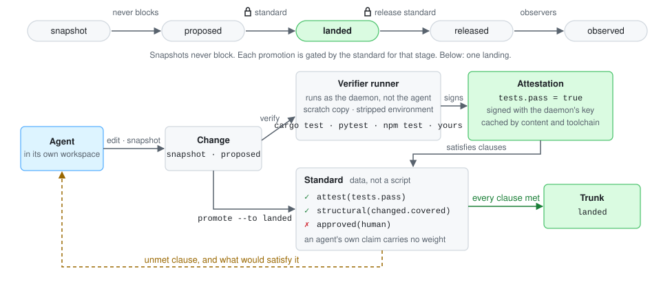
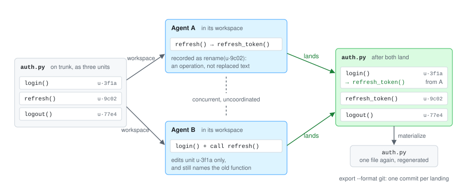
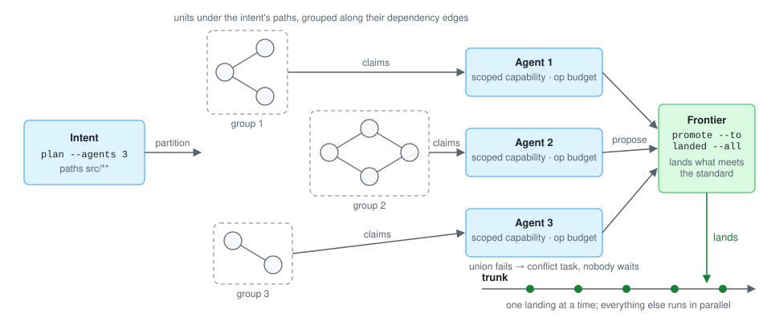
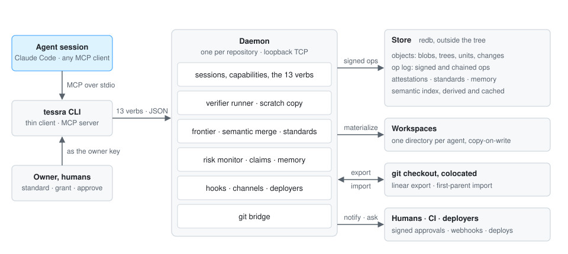

<p align="center"></p>

<h1 align="center">Tessra</h1>

<p align="center"><strong>The version control system for the era of AI.</strong></p>

<p align="center">
Git records what changed. Tessra records what changed, <em>why</em>, and <em>what is known to be true</em> about the result.<br>
Built for agents that write code around the clock, and for the humans who decide what to trust.
</p>

<p align="center">
<strong>Using Tessra</strong><br>
<a href="#why-tessra">Why Tessra</a> ·
<a href="#get-started">Get started</a> ·
<a href="#how-it-works">How it works</a> ·
<a href="#what-you-get">What you get</a> ·
<a href="#how-agents-use-it">How agents use it</a> ·
<a href="#standards-and-hooks">Standards and hooks</a>
</p>

<p align="center">
<strong>Working on Tessra</strong><br>
<a href="#architecture">Architecture</a> ·
<a href="#status">Status</a> ·
<a href="#design-documents">Design documents</a> ·
<a href="#developing">Developing</a>
</p>

<p align="center">


</p>

<p align="center">
<strong>About the name.</strong> A <em>tessera</em> is one tile in a mosaic. Tessra treats code the same way: functions, types, and imports are the tiles, each with an identity of its own, and a file is the picture they make when laid.
</p>

---

## Why Tessra

Code is no longer scarce. Agents write most of it, in parallel, and they never sleep. That breaks the assumptions every version control system was built on: one author at a time, one working directory, a human reading text output, and a human on hand to resolve conflicts.

The bottleneck has moved from writing code to knowing what to trust, why it exists, and how to coordinate many authors. Tessra is built for that bottleneck:

- **Nothing blocks.** A conflict, a failed check, or a missing review is a state stored in the repository, never an error that stops an agent.
- **Nothing lands unproven.** Landing is gated by a standard: a rule set the owner writes as data, satisfied only by signed attestations from verifiers. An agent's own claim that the tests pass carries no weight.
- **Files are a view.** The repository is a graph of semantic units, history, intents, and memory. Two agents editing different functions of one file never conflict.
- **Agents are the interface.** There is no UI. Thirteen verbs over a CLI and MCP, every response in one machine-readable shape, every read within a token budget.
- **Git stays where it is.** Tessra runs colocated with an existing git checkout and bridges losslessly in both directions, so a project can adopt it without leaving GitHub.

## Get started

Tessra is one binary. It runs on its own, or beside `.git/` in a checkout you already have. There is no server to run, nothing to sign up for, and no Rust toolchain to install.

### 1. Install

macOS and Linux:

```sh
curl --proto '=https' --tlsv1.2 -LsSf https://github.com/NitrusAphalion/tessra/releases/latest/download/tessra-cli-installer.sh | sh
```

Windows, in PowerShell:

```powershell
powershell -ExecutionPolicy Bypass -c "irm https://github.com/NitrusAphalion/tessra/releases/latest/download/tessra-cli-installer.ps1 | iex"
```

The installer puts `tessra` in `~/.local/bin` (`%USERPROFILE%\.local\bin` on Windows) and adds it to your `PATH`. Open a new terminal and check:

```sh
tessra --version
```

Git is optional. Tessra runs the `git` command only to import an existing checkout at `init` and for the git bridge. Every [release](https://github.com/NitrusAphalion/tessra/releases) also carries archives for x86_64 and arm64, checksums, and a source tarball. To build from source instead, see [Developing](#developing).

### 2. Initialize a repository

In any directory, with or without git:

```sh
tessra init               # in a git checkout, also imports HEAD and the last 100 commits as trunk
tessra status --pretty    # where you are: change, stage, standard, what changed
```

The object store and keys live under your local application data directory, never in the tree. In a git checkout, add `.tessra/` to your `.gitignore`; your git history is untouched.

### 3. Read, and remember what is not in the code

```sh
tessra context --path src/lib.rs --budget 2000    # what to know before changing a file, in N tokens
tessra remember --kind gotcha --body "the build needs GOFLAGS=-mod=mod" --scope-kind path --scope-ref backend
```

### 4. Make a change and land it

Every author works in a workspace of its own and lands through the standard. Run the loop once yourself, as an agent named `bot`:

```sh
tessra --agent bot workspace --action create                   # prints a workspace id
tessra --agent bot --workspace <id> edit --path src/x.rs --content "..."
tessra --agent bot --workspace <id> snapshot --title "handle the empty case" --then verify
tessra --agent bot --workspace <id> promote --to proposed
tessra promote --to landed --all              # as the owner: land everything that meets the standard
tessra export --format git --branch main      # landed revisions become ordinary git commits
```

`verify` runs your tests in a scratch copy and reports the standard clause by clause. When a clause is unmet, `promote` names it and says what would satisfy it.

### 5. Connect an agent

`tessra mcp` serves the thirteen verbs over stdio as `tessra_status`, `tessra_context`, `tessra_edit`, and so on. For Claude Code, add to `.mcp.json` in the repository:

```json
{
  "mcpServers": {
    "tessra": { "type": "stdio", "command": "tessra", "args": ["--agent", "claude", "mcp"] }
  }
}
```

The session acts as agent `claude`, proposes changes, and you land them. Any MCP client connects the same way. [How agents use it](#how-agents-use-it) describes the loop a session follows.

## How it works

Three mechanisms carry most of the design. Each picture shows one of them end to end.

### Nothing lands unproven

<p align="center"></p>

A snapshot never blocks; it records the workspace as it is. Landing is the gate. The daemon, not the agent, runs the verifiers in a scratch copy with a stripped environment and signs each result as an attestation, cached by content and toolchain. The standard is data: clauses over attestations, structure, judges, and human approval, scoped by path and risk. `promote` either lands the change or answers with the unmet clauses and what would satisfy each, and that answer is what drives an agent's loop.

### Files are a view

<p align="center"></p>

Tree-sitter splits a file into units with identities that survive edits, moves, and renames. Two agents editing different units of one file never conflict, and a rename recorded in one change is applied to a concurrent change that still uses the old name. Files are regenerated from units when a workspace is materialized, and `export --format git` turns each landing into an ordinary commit. Only two edits to the same unit collide, and that becomes a conflict task carrying both intents, not an error.

### Swarms without a merge queue

<p align="center"></p>

`plan` splits an intent into groups of units that share dependency edges and hands each group to an agent as a claim plus a scoped, budgeted capability. Agents propose in parallel. The frontier lands every proposed change that meets the standard, oldest first, and restacks the unlanded ones onto the new trunk. A union that fails verification becomes a conflict task attributed to both changes, and the frontier and every other agent keep moving.

## What you get

| | |
|---|---|
| **Semantic merge** | Tree-sitter parses Rust, Python, JavaScript, and TypeScript into units with identities that survive edits and renames; other files fall back to chunks. Landings merge at unit granularity. A rename in one change is carried into a concurrent change that still calls the old name. Twenty agents editing one file at once all land. |
| **Proof, not promises** | `verify` runs the verifiers the daemon detects (`cargo test`, `pytest`, `npm test`, or any command you configure) in a scratch copy with a stripped environment, and signs the result as an attestation cached by content and toolchain. When every changed unit has a covering test, only those tests run. |
| **Standards as data** | `tessra standard --require 'attest(tests.pass)' --require 'structural(changed.covered)' --forbid 'structural(test.weakened)'`. Clauses can require new tests to fail on the parent, a human above a risk level, or agreeing judges. A refusal names the unmet clause and what would satisfy it. |
| **Memory in the repository** | `remember` records gotchas, decisions, conventions, and questions as signed objects scoped to a unit, path, or intent. `context` recalls them next to the code. `export` renders them as `AGENTS.md` or `CLAUDE.md` for tools that do not speak Tessra. |
| **Context packs** | "What do I need to know to change X, in N tokens": the unit's text, what it depends on, what depends on it, the tests that cover it, memories about it, overlapping claims, and who last changed it. |
| **Swarms without a merge queue** | `plan` partitions an intent across agents by dependency blast radius and hands each a scoped, budgeted capability. The frontier lands every verified change, on demand or continuously through a hook. Fifty agents in the same files at once; tens of thousands of landings per hour on a small crate. |
| **Speculation** | `try` materializes several candidate edits as revisions of their own, verifies each, scores risk, and ranks them. Keep the best in one call. |
| **Humans by exception** | Approvals, judged exceptions, and questions reach people through channels the daemon owns, and a reply is a key-signed attestation the agent never touched. Ask what happened in the last hour at the altitude you want. |
| **A risk monitor** | Every change carries a score with its factors and what would lower each. Agents that write outside their claims or scope are throttled, then revoked, and their unlanded work is unwound in one op. |
| **Intent to production** | Targets, releases, canary slices, observers, and automatic rollback when an observed signal trips the target's standard. Tessra is the control plane; your deployer runs the containers. |
| **The git bridge** | `export --format git` turns landed trunk revisions into a clean linear history, one commit per landing authored by its agent. `import --branch` lands the commits your teammates made with git. |
| **State that travels** | A snapshot can carry the toolchain, lockfile hashes, and build state as trees, so checking out an earlier revision runs with no install step. |
| **Signed by default** | Every principal has a key; every op is signed, chained, and checked against a capability the verifier walks back to the owner. History is tamper-evident. |

## How agents use it

Every session follows one loop, and the repository remembers everything between sessions so the agent does not have to.

1. **`status`** first: your assignment, claims, open questions, your change's standard status, and what changed since you last looked.
2. **`context`** for what you are about to touch, within a token budget.
3. **`workspace`** if you do not have one. It is yours alone.
4. **`edit`**, then **`snapshot`**. Snapshot never blocks and never publishes; problems come back as flags.
5. **`verify`** before claiming anything. It returns the standard clause by clause, with what would satisfy each unmet one.
6. **`promote`** to land. If the standard is unmet, the response says exactly which clauses and how to fix them.
7. **`remember`** what you learned that is not in the code.

Every response has the same shape, so an agent reads state instead of inferring it:

```json
{
  "ok": true,
  "result": { "...": "..." },
  "state": {
    "workspace": "onqvqttk", "change": "qywskrnr", "stage": "proposed",
    "claims": ["auth.py:login"], "standard": { "met": 2, "unmet": 1 },
    "trunk": { "head": "dc1ef461", "seq": 99 }, "cursor": "755b5ef3"
  },
  "next": ["verify", "remember --kind gotcha ..."],
  "budget": { "used": 1830, "limit": 4000 }
}
```

Errors carry a `code`, the `unmet` clauses, and a `fix` you can run. Every mutation takes an idempotency key, so a retry never happens twice, and `undo` takes back your own recent operations.

The thirteen verbs are `status`, `context`, `query`, `workspace`, `edit`, `snapshot`, `claim`, `remember`, `verify`, `try`, `promote`, `revert`, and `undo`. Administrative verbs such as `standard`, `hook`, `grant`, `target`, and `release` are owner-gated. [VERBS.md](VERBS.md) explains each name; [spec/06-manual.md](spec/06-manual.md) is the whole manual for an agent, in about a thousand tokens.

## Standards and hooks

Standards gate; hooks react. A standard says what must be true before a change lands. A hook says what happens when something does. Both are data in the repository: the owner edits them, every agent can read them, and every evaluation and every hook run is an op you can query.

### Writing a standard

`tessra standard` shows the trunk standard. After `init` it holds one clause, `require structural(flags.none)`. The owner adds clauses with `--require` and `--forbid`, drops one with `--remove` by its text or index, and gates clauses by risk with `--when`:

```sh
tessra standard --require 'attest(tests.pass)'                            # the daemon's own test run passes
tessra standard --require 'attest(tests.fail_on_parent, for=new_tests)'   # new tests fail without the change
tessra standard --require 'structural(changed.covered)'                   # every changed unit has a covering test
tessra standard --forbid  'structural(test.weakened)'                     # no assertion removed, no test skipped
tessra standard --when high --require 'approved(human, keysigned=true)'   # a person signs off at high risk and above
tessra standard                                                           # show it, clause by clause
```

`--when` applies to every clause added in the same command, so keep risk-gated clauses in an invocation of their own. A clause is `kind(name, key=value)`; `all(...)`, `any(...)`, and `not(...)` nest, and `unless` adds an escape hatch.

| Clause | Satisfied by |
|---|---|
| `attest(<kind>)` | An attestation of that kind signed by the daemon's verifier runner or by a principal you granted. `tests.pass` comes from `verify`; `for=new_tests` limits `tests.fail_on_parent` to tests the change added. |
| `structural(<check>)` | The change itself: `flags.none`, `intent.linked`, `changed.covered`, `test.modified`, `test.deleted`, `test.weakened`, `test.skipped`. |
| `approved(human, keysigned=true)` | An approval from a human principal, answered through a channel. With `keysigned`, only a reply signed with the key the daemon holds for that person counts. |
| `judge(<rubric>, judges=2, distinct_models=true, min_confidence=700)` | Agreeing attestations from judge sessions run by agents other than the author. Append `unless approved(human)` to let a person settle a split verdict. |
| `observe(<signal>, max=50)` | For a target's release standard, edited with `--target prod`: an observer signal within bounds. |

An agent's own `attest` is stored but never satisfies a clause. When `verify` or `promote` finds a clause unmet, the response names the clause and the command that would satisfy it.

### Bringing in your CI

An external system becomes a verifier by attesting under a principal you grant it. The standard then consumes its attestations like any other:

```sh
tessra grant --external ci                                                       # a principal that may only attest
tessra hook --name notify-ci --on proposed --do 'webhook(https://ci.example.com/run)'
tessra standard --require 'attest(ci.pass)'
```

The hook posts the event as JSON with a daemon signature in the `X-Tessra-Signature` header. When the run finishes, CI calls back:

```sh
tessra --as ci attest --kind ci.pass --subject <snapshot> --result true
```

### Writing a hook

A hook is an event, an optional filter, and one or more actions. It never blocks a promotion: anything that must block is a clause in the standard, and a hook can only affect one indirectly, by producing an attestation the standard consumes.

```sh
tessra hook --name notify-ci --on proposed        --where 'scope(src/**)' --do 'webhook(http://ci.local/run)'
tessra hook --name auto-land --on proposed        --do 'land()'                       # a continuous frontier
tessra hook --name triage    --on conflict.opened --do 'task(look at this)'
tessra hook --name page      --on observed.fail   --do 'notify(channel=oncall, text=canary tripped)'
tessra hook --name fix-it    --on 'conflict.*'    --do 'agent(resolver, intent=resolve this conflict, budget=20000)'
tessra hook --name ci-script --on landed --where 'all(scope(src/**), not(author(bot)))' --do 'run(./ci.sh)'
tessra hook                                                                            # list them
tessra hook --name notify-ci --disable                                                 # and --enable
```

Events are `snapshot`, `proposed`, `landed`, `conflict.opened`, `released`, `deployed`, `observed`, `observed.fail`, `target.rolled_back`, `anomaly.detected`, `anomaly.revoked`, or a family such as `conflict.*`. Filters are `scope(<glob>)`, `author(<prefix>)`, `title(<text>)`, and `event(<pattern>)`, combined with `all`, `any`, and `not`.

| Action | Does |
|---|---|
| `webhook(<url>)` | POSTs the event as JSON, signed in `X-Tessra-Signature` |
| `run(<command>)` | Runs a command with the event on stdin |
| `verify()` | Runs the verifiers on the change now |
| `attest(<kind>)` | Records an attestation under the hook's principal |
| `land()` | Lands the change if the standard holds |
| `task(<text>)`, `remember(<text>)` | Opens a task, or records a memory, attached to the event |
| `notify(channel=<name>, text=<text>)` | Delivers a message to a channel |
| `agent(<name>, intent=<text>, budget=<ops>)` | Starts an agent through the runner set with `tessra config --set agent_runner=<command>`, scoped to the event's paths |

Actions run with the hook's principal and nothing more. Every run is an op with its triggering event and outcome, so "why did this fire" and "why did it not" are queries. [PIPELINE.md](PIPELINE.md) and [HOOKS.md](HOOKS.md) argue the design; [DEVELOPING.md](DEVELOPING.md) has every option.

---

*The rest of this page is for people working on Tessra itself.*

## Architecture

<p align="center"></p>

The CLI is a thin client. An agent session speaks MCP over stdio to `tessra mcp`, and every verb reaches a daemon that runs once per repository over loopback TCP, opens the store once, keeps sessions in memory, and exits when idle. The daemon owns everything that must not be forged: capabilities, the verifier runner, the frontier, hooks and channels, and the git bridge.

| Crate | Holds |
|---|---|
| `tessra-core` | Canonical CBOR, BLAKE3 identities, Ed25519 signatures, the object catalog, the persistent trie |
| `tessra-oplog` | Views, effects, deterministic merge, the op DAG and its verification, standards, undo |
| `tessra-store` | The redb object store, heads, the idempotency index, the pack format |
| `tessra-semantic` | Tree-sitter extraction, format-insensitive body hashes, history-aware unit identity, renames as data, node-level three-way merge |
| `tessra-daemon` | Repository layout, workspaces, principals and sessions, the verbs, verifiers, hooks, risk, swarm, delivery, the git bridge, the loopback server |
| `tessra-cli` | The `tessra` command and the MCP server |

A few decisions that shape everything else, argued in [VISION.md](VISION.md) and settled in [spec/](spec/README.md):

- **Snapshots with stable change IDs**, not patch theory. Semantic merge is layered above.
- **An operation log** of signed, chained effects; every replica re-evaluates a landing's standard against the attestations it cites, so the hub can be untrusted storage.
- **Blobs are the source of truth**; the semantic index is derived and cached, so matching can improve without a format migration.
- **Budgets everywhere.** No read is unbounded; every response reports what it used.
- **Daemon-first.** The CLI is a thin client; the daemon opens the store once, keeps sessions in memory, and exits when idle.

## Status

Tessra is pre-release and under active development. Every milestone on the [roadmap](ROADMAP.md), M0 through M8, has a passing end-to-end demo: substrate, semantic merge, standards and verification, swarms, the agent surface, production, the git bridge, and state bundles. The repository is developed under Tessra, and it is being dogfooded on a real product monorepo.

What that does and does not mean today:

- **Single machine.** The hub and multi-machine sync are specified but not built. One daemon serves one repository over loopback.
- **Verifiers run as the daemon** with a stripped environment, not in a container. Secrets are flagged at snapshot, not kept out of the store.
- **Git export is linear** and landing merges are not exported as git merges. Import is first-parent. Submodules, signed commits, notes, and tags do not round-trip.
- **Grammars:** Rust, Python, JavaScript, TypeScript. Everything else is chunk-matched, which still merges but with coarser identity.
- **Platform:** developed and tested on Windows 11. macOS and Linux paths exist and are untested.
- **Performance budgets** from the spec, such as `status` under 50 ms, a context pack under 500 ms warm, and a verification cache hit under 10 ms, are measured by `tessra bench` and recorded as signed attestations.

The full list of deviations from the spec is in [spec/README.md](spec/README.md). Bugs are tracked as [GitHub issues](https://github.com/NitrusAphalion/tessra/issues); the entries from the private dogfooding period live in [BUGS.md](BUGS.md).

## Design documents

Start with [VISION.md](VISION.md). The rest are companions it links to.

| Document | What it covers |
|---|---|
| [VISION.md](VISION.md) | Thesis, principles, the thirteen bets, architecture, decisions |
| [TENETS.md](TENETS.md) | Constraints derived from how models work. The tiebreaker when scope is argued |
| [ADOPTION.md](ADOPTION.md) | Why git won and how Tessra wins |
| [ROADMAP.md](ROADMAP.md) | Milestones M0 through M8, each defined by a demo |
| [MEMORY.md](MEMORY.md) | Memory as typed objects in the graph. Agents record and recall through the VCS |
| [PARALLELISM.md](PARALLELISM.md) | Many agents in one repository and one file, without a merge queue |
| [PIPELINE.md](PIPELINE.md) | Standards, verifiers, stages, and review by exception |
| [TESTING.md](TESTING.md) | Tests as nodes, coverage as a node-level relation, tests as proof |
| [LIFECYCLE.md](LIFECYCLE.md) | No screens, agents as the interface, channels, intent to production |
| [HOOKS.md](HOOKS.md) | Subscriptions to the operation log with actions, including agents |
| [RISK.md](RISK.md) | The continuous risk monitor and what it drives |
| [SECURITY.md](SECURITY.md) | Threat model, keys, signed ops, capabilities, verifier isolation |
| [VERBS.md](VERBS.md) | The thirteen agent verbs, the response shape, and the manual |
| [GAPS.md](GAPS.md) | The sweep against git and competing systems: what was decided and what remains open, with a draft glossary |

The specification lives in [spec/](spec/README.md): conventions, the object catalog, operations and sync, security, on-disk layout, and the agent manual. When a design document and the spec disagree, the spec wins and the design document gets fixed.

## Developing

You need Rust 1.80+ (stable) and git. On Windows, add Visual Studio Build Tools with the C++ workload, which the tree-sitter grammars need.

```sh
git clone https://github.com/NitrusAphalion/tessra
cd tessra
cargo test --workspace
cargo clippy --workspace --all-targets
cargo install --path crates/tessra-cli    # installs the tessra binary from this checkout
```

[DEVELOPING.md](DEVELOPING.md) covers the toolchain, the crate layout, every verb with examples, the daemon, and how a release is cut. Found a bug? [File an issue](https://github.com/NitrusAphalion/tessra/issues/new?template=bug_report.md); [BUGS.md](BUGS.md) has the template and the workflow a session follows to fix it.

## License

MIT.
